# MediCall - Hospital Call Center Management System

A comprehensive Next.js application for managing hospital call center operations, patient reminders, and appointment bookings with AI-powered voice calling capabilities.

## 🏥 Features

### Core Modules

- **Dashboard & Authentication** - Secure login and overview analytics
- **Patient Registration** - Complete patient onboarding with medication schedules
- **Patient Management** - Search, filter, and manage patient records
- **Doctor Directory** - Doctor profiles with availability management
- **Active Bookings** - Appointment scheduling and calendar management
- **Call History** - Comprehensive call logging and analytics
- **Settings** - System configuration and user preferences

### Key Capabilities

- 🤖 **AI-Powered Calling** - Automated voice reminders via Bland.ai
- 📱 **Multi-Channel Reminders** - SMS, voice calls, and email notifications
- 📊 **Real-time Analytics** - Dashboard with call success rates and metrics
- 🔒 **Secure Authentication** - Role-based access control
- 📋 **Prescription Management** - Upload and manage prescription images
- 🎯 **Emergency Handling** - Automatic emergency call transfers
- 📅 **Smart Scheduling** - Doctor availability and appointment booking

## 🛠️ Technology Stack

- **Frontend**: Next.js 13+ (App Router), React, TypeScript
- **Styling**: Tailwind CSS, shadcn/ui components
- **Database**: MongoDB with Mongoose ODM
- **Authentication**: NextAuth.js
- **AI Integration**: Bland.ai for voice calls and SMS
- **Animations**: Framer Motion
- **File Upload**: Built-in file handling system

## Sequence Diagram

```mermaid
sequenceDiagram
    participant Agent as 🏥 Agent
    participant Dashboard as �� MediCall Dashboard
    participant DB as 🗄️ MongoDB
    participant BlandAI as 🤖 Bland.ai API
    participant Patient as 👤 Patient
    participant Doctor as 👨‍⚕️ Doctor

    Note over Agent,Doctor: Phase 1: Patient Registration & Setup
    Agent->>Dashboard: 1. Login to system
    Agent->>Dashboard: 2. Register new patient
    Dashboard->>DB: 3. Save patient data
    DB-->>Dashboard: 4. Patient saved confirmation
    Dashboard-->>Agent: 5. Patient registered successfully

    Note over Agent,Doctor: Phase 2: Call Scheduling & Execution
    Agent->>Dashboard: 6. Schedule medication call
    Dashboard->>DB: 7. Create call log entry
    DB-->>Dashboard: 8. Call log created
    Dashboard->>Dashboard: 9. Generate personalized call script
    Dashboard->>BlandAI: 10. Make AI call request
    BlandAI->>Patient: 11. Call patient phone
    Patient->>BlandAI: 12. Patient answers/responds
    BlandAI->>BlandAI: 13. Process call completion

    Note over Agent,Doctor: Phase 3: Call Result Processing
    BlandAI->>Dashboard: 14. Webhook: Send call results
    Dashboard->>DB: 15. Update call log with results
    DB-->>Dashboard: 16. Call log updated
    Agent->>Dashboard: 17. View call results
    Dashboard->>DB: 18. Fetch call logs
    DB-->>Dashboard: 19. Return call history
    Dashboard-->>Agent: 20. Display call outcomes

    Note over Agent,Doctor: Phase 4: Doctor Coordination
    Agent->>Dashboard: 21. Assign follow-up to doctor
    Dashboard->>DB: 22. Create doctor task
    DB-->>Dashboard: 23. Task saved
    Dashboard->>Doctor: 24. Send notification
    Doctor->>Dashboard: 25. Review patient case
    Doctor->>Dashboard: 26. Provide medical recommendations
    Agent->>Dashboard: 27. View doctor response
    Dashboard->>DB: 28. Fetch doctor actions
    DB-->>Dashboard: 29. Return doctor recommendations
    Dashboard-->>Agent: 30. Display doctor actions

    Note over Agent,Doctor: Automated Workflows
    loop Scheduled Calls
        Dashboard->>BlandAI: Auto: Trigger medication call
        BlandAI->>Patient: Auto: Make scheduled call
        BlandAI->>Dashboard: Auto: Send results via webhook
    end

    Note over Agent,Doctor: Emergency Handling
    alt Emergency Detected
        BlandAI->>Dashboard: �� Emergency keywords detected
        Dashboard->>DB: Log emergency alert
        Dashboard->>Doctor: 🚨 Immediate doctor notification
        Doctor->>Dashboard: Emergency response
    end
```



## 📦 Installation

1. **Clone the repository**

   ```bash
   git clone <repository-url>
   cd hospital-call-center
   ```

2. **Install dependencies**

   ```bash
   npm install
   ```

3. **Environment Setup**
   Create a `.env.local` file in the root directory:

   ```env
   # MongoDB
   MONGODB_URI=mongodb+srv://<username>:<password>@cluster0.mongodb.net/medicall?retryWrites=true&w=majority
   DATABASE_NAME=medicall

   # Bland.ai
   BLANDAI_API_KEY=your_blandai_api_key_here

   # NextAuth.js
   NEXTAUTH_URL=http://localhost:3000
   NEXTAUTH_SECRET=your_nextauth_secret_here

   # SMTP (Optional - for email notifications)
   SMTP_HOST=smtp.example.com
   SMTP_PORT=587
   SMTP_USER=your_smtp_username
   SMTP_PASS=your_smtp_password
   ```

4. **Run the development server**

   ```bash
   npm run dev
   ```

5. **Access the application**
   Open [http://localhost:3000](http://localhost:3000) in your browser

## 🗄️ Database Schema

### Collections

- **Users** - Agent accounts and authentication
- **Patients** - Patient records with medication schedules
- **Doctors** - Doctor profiles and availability
- **Bookings** - Appointment scheduling data
- **CallLogs** - Call history and outcomes

### Key Features

- Mongoose ODM for type-safe database operations
- Automatic timestamps and validation
- Relationship mapping between collections
- Indexed fields for optimal query performance

## 🔧 API Endpoints

### Patients

- `GET /api/patients` - Fetch patients with filtering
- `POST /api/patients` - Create new patient record

### Doctors

- `GET /api/doctors` - Fetch doctors with filtering
- `POST /api/doctors` - Add new doctor

### Bookings

- `GET /api/bookings` - Fetch appointments
- `POST /api/bookings` - Create new booking

### Call Logs

- `GET /api/call-logs` - Fetch call history
- `POST /api/call-logs` - Log new call

### File Upload

- `POST /api/upload` - Upload prescription images and profile photos

### Webhooks

- `POST /api/bland-ai/webhook` - Handle Bland.ai call status updates

## 🎨 UI/UX Design

### Design System

- **Primary Colors**: Blue (#3B82F6), Teal (#14B8A6)
- **Typography**: Inter font family with consistent sizing
- **Spacing**: 8px grid system for consistent layouts
- **Components**: shadcn/ui for accessible, customizable components

### Responsive Design

- Mobile-first approach with breakpoints at 768px, 1024px, 1280px
- Collapsible sidebar navigation for space efficiency
- Optimized touch targets for mobile devices

### Animations

- Smooth page transitions with Framer Motion
- Micro-interactions for better user feedback
- Loading states and skeleton screens

## 🔐 Authentication & Security

- Secure session management with NextAuth.js
- Role-based access control (Agent, Admin, Supervisor)
- Password hashing and secure storage
- API route protection middleware
- Input validation and sanitization

## 📱 Bland.ai Integration

### Voice Calling

```javascript
// Example: Making an automated reminder call
const callResult = await blandAiService.makeCall(
  patient.mobileNumber,
  generateMedicationReminderScript(patient.name, medication.name, medication.dosage),
  patient.name,
);
```

### SMS Notifications

```javascript
// Example: Sending SMS reminder
const smsResult = await blandAiService.sendSMS(
  patient.mobileNumber,
  `Hi ${patient.name}, this is a reminder to take your ${medication.name} medication.`,
);
```

## 🚀 Deployment

### Production Build

```bash
npm run build
npm start
```

### Environment Variables (Production)

Ensure all environment variables are properly set in your production environment, especially:

- MongoDB connection string with proper authentication
- Bland.ai API key with sufficient credits
- Secure NextAuth secret for session encryption

### Recommended Hosting

- **Vercel** - Optimal for Next.js applications
- **Railway** - Good for full-stack apps with databases
- **DigitalOcean** - For custom server configurations

## 📊 Monitoring & Analytics

### Built-in Analytics

- Call success rates and failure analysis
- Patient engagement metrics
- Agent performance tracking
- Emergency call response times

### Logging

- Comprehensive error logging
- Call outcome tracking
- User activity monitoring
- System performance metrics

## 🤝 Contributing

1. Fork the repository
2. Create a feature branch (`git checkout -b feature/amazing-feature`)
3. Commit your changes (`git commit -m 'Add amazing feature'`)
4. Push to the branch (`git push origin feature/amazing-feature`)
5. Open a Pull Request

## 📄 License

This project is licensed under the MIT License - see the [LICENSE](LICENSE) file for details.

## 🆘 Support

For support and questions:

- Create an issue in the GitHub repository
- Check the documentation in the `/docs` folder
- Review the API documentation at `/api-docs` (when running locally)

## 🔄 Version History

- **v1.0.0** - Initial release with core functionality
- **v1.1.0** - Added prescription image upload
- **v1.2.0** - Enhanced call analytics and reporting
- **v1.3.0** - Improved mobile responsiveness

---

Built with ❤️ for healthcare professionals to improve patient care and operational efficiency.
